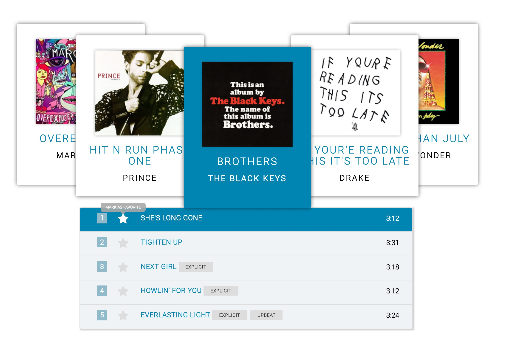

# Jukebox

Make a scrolling carousel for music selections base on this mockup

====

## Features

- On load: -- get albums from Heroku api, -- pre-select Drake's album, -- display album name, and songs with each song's attribute. -- uppercase all names,
- Auto scrolling on load. stop scrolling after one cycle of all albums.
- Stops scrolling on hover.
- Ellipsis on long song names.
- Animated shuffles and animated song list collapse and expand.
- Persisted favorite songs to MongoDB

[View it in action](https://jukebox-carousel.herokuapp.com/) <https://jukebox-carousel.herokuapp.com/>
